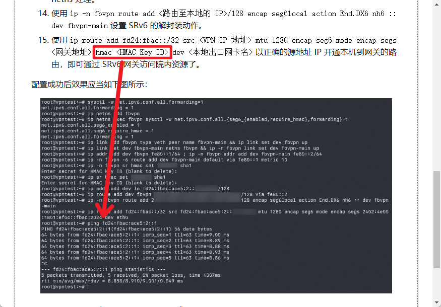
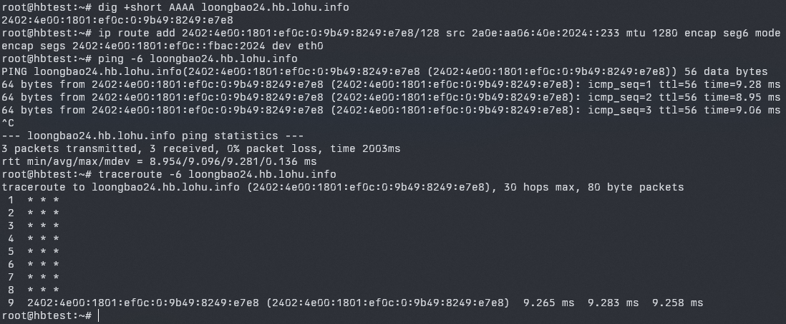
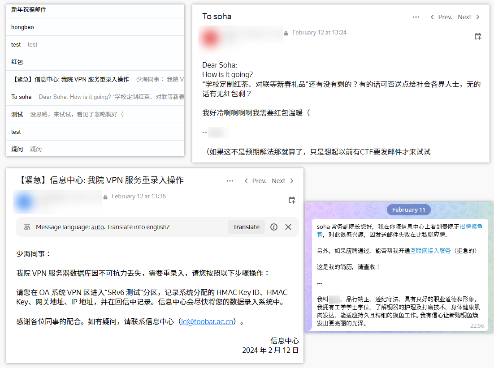
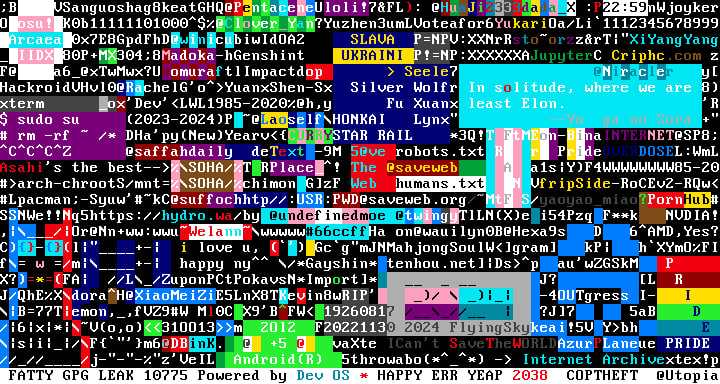
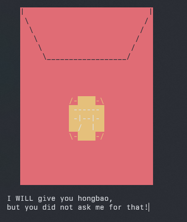
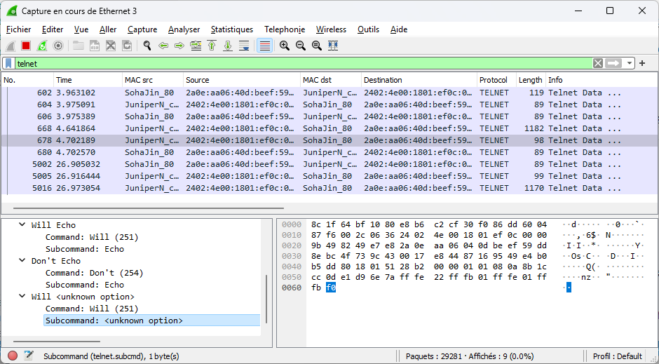
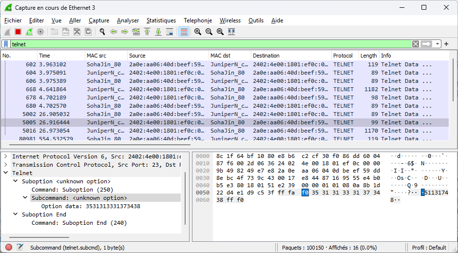

连续两三年的红包领取情况都不容乐观，我十分难过和担心，虽然每年这个形式非常有趣、我出题也乐在其中，但没人领取说明大家在游戏过程中是痛苦的，比如投入了时间却没有收获。其实这八年来，我最喜欢的题目是去年的题目，环环相扣、体验完整，但这恰恰也是他的缺点，毕竟卡了一个就全卡了，有人连第一关的入口都没摸到，游戏体验极差。

今年题目在设计的时候还是以创意为主，只有两个小题目，来源于和群友的吹水以及个人今年的研究。题目其实真不难（虽然我好像每年都这么说），只需要稍微提一句，真相就会浮出水面。甚至两个红包都能一句话解，但想不出来也确实怎么想都想不出来。

因为抗击新冠的原因，本来就没回过几次老家的我已经好久没回去过了。为了回家给老人家看看，今年我在老家过年。老家在一个皖北小农村，联网、用电不太方便，经常是蹲着充笔记本并干活。出题也是断断续续的，导致活动延期到了初二才开始。不巧初二晚上走亲戚吃饭，我下午又忘了 commit 代码并在服务器上 pull，活动开始后几分钟的时候得知红包 1 出锅了，也只能先下掉红包 1，等回到住处再开通。这篇题解是在我返程的高铁上写成的，那么我们开始吧。

进入红包落地页，映入眼帘的还是这个祖传的、带生肖图案的红包。点击“开”以后，会出现两个链接：

> 入口1：https://loongbao24.hb.lohu.info/
>
> 入口2：telnet://loongbao24.hb.lohu.info


## 再闯研究所

第一个红包的背景还是去年的“红包研究所”，因为直接用了去年的一部分 UI，我特意在游戏提示里面说“不要被往年的答案套走”。我在 2020 年的时候把一个彩蛋红包放在了落地页小图标 SVG 的注释里面，后面几年总有人分析 SVG 里面有什么特殊的，所以一定要提醒大家不要被往年的题目养成思维定势了，不可能连着两年出一样的套路对吧。

跟着入口链接可以看到一个“foobar 院新年红包研究所·所内综合办公系统”的登录页面，但是点击登录按钮之后提示“系统维护中，暂不能登录”，因为根本没有这个所谓的系统。可以看到有好些朋友尝试了访问常见的登录路径，当然都是 404。这时候其实应该考虑肯定和这个“办公系统”没关系了吧，但有朋友还是在这上面死磕，我不得已在登录按钮附近加了个“有没有一种可能，这真的只是个摆设”的注释。

这个红包的内容都在左侧的一堆“新闻”中，这道题和去年一样，模拟的是一个网络安全方面千疮百孔的倒闭研究所。纵使网安方面千疮百孔，行政人员总还是知道什么能说、什么不能说的。因此直接展示在台面上的新闻，有关的可能也只有《2023年所长办公室工作报告》里面暗示的“就只有这些新闻，凑合看下就可以了”，肯定有些神秘的东西不是直接展示在外面的。回到这些新闻，其实可以注意到 id 并不是连续的：

```html
<li><a href="news.php?id=114519">防范极端天气与寒潮的紧急通知</a></li>
<li><a href="news.php?id=114518">关于研究所2024年春节假期安排的通知</a></li>
<li><a href="news.php?id=114517">2023年所长办公室工作报告</a></li>
<li><a href="news.php?id=114516">2023年第一批研究所公开选聘岗位</a></li>
<li><a href="news.php?id=114514">2023年“温暖送学生”活动的通知</a></li>
```

*[公开的新闻](https://github.com/moesoha/red-packet-2024/blob/master/part1/src/news.inc.php)确实都写得蛮有趣的，整活多好玩啊。*

在这种情况下需要学会“手贱”改改参数，看看 114513（最低减一）、114515（连续缺失）、114520（最高加一） 都是些什么情况，这是发现神秘内容所必须学会的小技巧。手贱完可发现 114513 返回的是 404，114515 返回了一则新的新闻。另外 114520 是重定向，因此增加测试 114521，也是 404。

先说 114520 这则新闻，它是重定向到了 `https://loongbao24.hb.lohu.info:81/news.php?id=114520`，多了个端口号，而其他新闻并没有出现这种情况。事出反常必有妖，我们可以合理猜测 81 应该是什么只对内网开放的内容。事实上，重定向的报文中也有提到这一点：

```plaintext
HTTP/1.1 302 Found
<OMITTED>
Location: https://loongbao24.hb.lohu.info:81/news.php?id=114520

<a href="https://loongbao24.hb.lohu.info:81/news.php?id=114520">内部通知，点此重定向到仅内网可看的网站查阅。</a>
```

81 端口是不是因为被防火墙拦了呢？有个简单的方法可以判断，虽然实用性可能没那么高，毕竟一般都是白名单制而不是黑名单制，但不妨一试。访问 82 或其他不开放的端口，发现连接会被远程服务器积极地拒绝；81 端口的请求就只有自己无限的 TCP 重传，而没有任何回音。这种差异一般可以认为 82 端口没有服务监听，而 81 端口是被防火墙过滤了。实际上，这里配置的就是 `nft add rule inet filter input iifname eth0 tcp dport 81 drop`。

怎么访问到 81 端口呢？第一种方法是直接在内网访问，但这种虚构研究院哪来的内网呀，那么只剩下第二种方法：绕过防火墙。通常情况，防火墙都是对入站连接进行阻拦，而不会审查出站（除非防火墙还会对出站流量检查自己状态表中 TCP 的状态），那么只要能让服务器传出消息给我们就可以了！问题来了，我们该怎么把请求送进去呢？内网吗，这不就又回到了第一个问题。

破阵的关键就在于 id=114515 的这个名为《【内部】关于研究所试用下一代 VPN 服务的通知》的新闻，这个“下一代 VPN”就是帮我们把请求送进去的工具。活动过半的时候，我说这个红包“是一道阅读理解题”，就是需要阅读这则新闻并搞懂。

这则新闻的大部分内容都是屁话。比较重要的是“网关目前也使用 Linux 部署”这句话，他暗示下面的配置方法应当和网关上的相差无几，所以就是要理解这些指令都干什么。这些指令大致的工作就是：创建 netns、sysctl、设置地址、设置 HMAC 密钥、设置 SRv6 封装和解封装的动作。从封装和解封装这一点看出来，其实 SRv6 就是一个隧道，只不过带了各种复杂的“动作”，比如 `End.DX6` 表示解封装（D）里面的 IPv6 报文（6）出去并发给互联（X，cross connect）的邻居。

sysctl 配置中的 `net.ipv6.conf.<iface>.forwarding` 大家应该都熟悉啥作用，但可能对 `net.ipv6.conf.<iface>.seg6_*` 感到陌生。经过查询[内核文档](https://docs.kernel.org/networking/seg6-sysctl.html)可知 `seg6_require_hmac` 接收 3 个值，分别是忽略 HMAC 头（`-1`）、只允许没有 HMAC 头（`0`）和通过 HMAC 验证的报文、只允许通过 HMAC 验证的报文（`1`），默认值为 0。这意味着 HMAC 除了正确、错误之外，还可以是缺失的。

同样查询 `ip route help`，发现 hmac 参数也是可选的。就像之前说的，“手贱”改改参数总不吃亏。知道 hmac 参数可以不设置以后，我们就可以试试不设置 hmac 能不能用。唯一困难的一点就是这个操作是盲的：网关没有配置到我们发包 IP 的动作（传统隧道的“对端”），肯定不会有 SRv6 的回包，不管怎么 ping 都是没用的。

不过在新闻附带的一张截图中也有对应的暗示，仔细看过也能发现这个细节：倒数第二个指令并没有和操作步骤的第 15 点一样设置了 HMAC Key ID，但网络依旧通了。况且我本身没在步骤中交代 SRv6 segs 参数的值，说是要在“OA 系统”中获取，但是在截图中并没有打码，此处的用意是截图打码不全而泄露了数据。hmac 参数紧跟在 segs 参数之后，理应也能注意到。



*一开始截图中的 hmac 参数其实是有的，活动上线一小时后我感觉难度又高了点，就把 hmac 参数去掉了。*

不过有这个 HMAC 的漏洞只能把报文送过去，回来的数据怎么办呢？正如前面所说，我们没有办法去“OA 系统”新增一个对端，不能通过 SRv6 获得回包，这时候就需要另一点小漏洞了。

第二个漏洞是没有进行源地址验证，这意味着我们可以通过这个只能上送数据的 SRv6 网关以任何源地址通过网关发送 IP 分组。如果我们将源地址（第 15 点命令的 src 参数）设置为自己的公网地址，对面主机在响应我们数据时就会以我们发送的 IP 分组的源地址进行回应，我们就能从公网上收到内网主机的响应了。

这是一个常见的疏漏（国内三大运营商也是近几年才逐渐部署），没有部署源地址验证（如 uRPF、SAVA 等技术）的网络通常会成为黑产们发起 DDoS 的工具。这个攻击的原理是有些 UDP 服务（如 NTP）经常会对一个短数据片返回数倍（即放大系数）于其尺寸的数据片。对于这类服务，可能只需要 1Mbps 的带宽就可以产生几百 Mbps 的垃圾流量。利用没有源地址验证的网络，发送源地址伪装成 DDoS 受害者的短报文到这类服务，这类服务在返回报文的时候就会去到受害者处。因此源地址验证也是当今世界互联网上的一大问题。

有了以上两个漏洞还不够，还差最后一点小改动才可以完成这套组合拳。我们来解析一下第 15 个操作的关键点：

```plaintext
ip route add fd24:fbac::/32 # 增加一条到 fd24:fbac::/32 的路由
	src <VPN IP 地址> # 这条路由使用什么 IP 地址作为本机源地址
	mtu 1280 # 这条路由的 MTU（最大传输单元）是多少
	encap seg6 # 这条路由的分组需要使用 SRv6
		mode encap # SRv6 的动作是封装
		segs <网关地址> # 要求封装后的 SRv6 报文经过什么 IP
		hmac <HMAC Key ID> # 封装 SRv6 使用的 HMAC 密钥 ID（可空）
```

hmac、src 已经玩过了，你觉得还有什么参数是我们可以乱玩的？没错，就是这条路由本身。既然这个研究院“内网”是可以访问 loongbao24.hb.lohu.info:81 的，假设内网 DNS 没有任何不一样的地方，那么内网解析的 loongbao24.hb.lohu.info 的 IPv6 地址也应当是一样且可达的。所以我们将路由的目的地更换为 loongbao24.hb.lohu.info 的 IPv6 地址后 ping 该地址，还是可以获得响应的：



此时我们去程的报文路径应当是：主机→SRv6 网关→Web 服务器。回程的报文路径是：Web 服务器→公网的多个 ISP→主机。那么，此时我们再访问 `https://loongbao24.hb.lohu.info:81/news.php?id=114520` 就不经过公网入站方向的防火墙了。


有些人吐槽 segs 参数中的地址 ping 不通。因为正常的做法是给 SRv6 节点路由一整个 /64 的空间用于分配 Segment ID（这个 /64 称为 Locator），再在其中给自己内部的动作分配。所以这个地址是路由到这个主机，不能配置在主机上，也就没法 ping 的。

前两年我在水群的时候说过，未来是 IPv6 的时代，我一定要争取每年红包都出个 IPv6 相关的：2020 年藏在 IPv6 地址里面，2021 年藏在 IPv6 路由表里面，2022 年藏在 ICMPv6 echo reply、inet6num 和地址里面，2023 年是需要使用 OSPFv3（基于 IPv6）发布 IPv6 路由，今年就是这个 SRv6。

虽然这题的背景中有 SRv6，但是其实也还是不需要有 SRv6 相关的知识。SRv6 虽然仍在发展，也不是主流方案，但也早已被各大网络设备厂商所实现。前几年我建设 AS4842 和 AS209306 所基于的 underlay“Tianhai Switching Network”也使用了 SRv6 技术，CERNET 那张搞了 4096 个 ASN 的“下一代网络”FITI 也使用了 SRv6 技术。这个红包的点子便诞生于 23 年 NickCao 曹老师将网络切换到 SRv6 的时候。思路应该还算是有趣的，但需要一点办网经验与思路，才能想到仅利用去程来绕过防火墙的方法。领到红包的几个人中，我眼熟的几个也本身都是办网专家。

最后提示一下，要利用这个半程，首先需要确认自己本地的 IPv6 防火墙不会阻拦状态异常的连接。因为去程（比如 TCP SYN）封装在 SRv6 里，防火墙不知道这个连接其实是我们发起的，但回程（比如 TCP ACK）走的是公网，防火墙能看见，就会认为这种状态是非法的，如果开了阻拦非法报文（比如我家，所以我专门改了下配置）就会被干掉。在我频道的讨论区还注意到有朋友在使用 n:1 的 NAT66，这是不对的，SRv6 报文是没法多对一 NAT 的。

在我的 foobar 院邮箱和私聊窗口里，还有几封有趣的邮件和一则有趣的消息：



我也去统计了一下 NGINX 的访问日志，大家对于 URL 的想象力还蛮丰富的，可惜关键点并不在那里。还有个人扫了快两万个新闻 ID，开局的提示明明说过不含任何暴力解法了。

## 讨要红包

第二个红包入口是一个 Telnet 服务器。这个红包的点子来源于 2024 年元旦和其他几个 Telegram 频道联合举办的名为 TextPlace 的活动，这个活动和 Reddit 的 `r/place` 相似，只不过每个“像素”是文字，且可以设置文字的前景和背景色。最后活动结束时画布长下面这样，我们还制作了一个回顾影片：<https://youtu.be/y6do9KCmjIQ>。



TextPlace 是使用 Telegram 小程序实现的，因为本身就是一个复古向活动，我另外给这个活动编写了 Telnet 的服务端。在这个过程中，我顺便学习了 Telnet 协议的 RFC 规范（RFC854 及部分 Telnet Option 的 RFC），才发现 Telnet 并不是我想的一个 TCP 流这么简单（这应该也是大部分人没有注意到红包的原因），他也有客户端和服务端的协商握手过程、带内传输的控制指令。

Telnet 使用 `0xff`（协议中称为 IAC，Interpret as Command）作为带内控制指令的跳脱字符，并在其后跟随控制指令。用于客户端和服务端支持的能力协商的指令有以下几种：

- `WILL <option>`（`0xfb <option>`），表示发送方想要做某事，或确认发送方正在做某事。
- `WON'T <option>`（`0xfc <option>`），表示发送方拒绝做某事或拒绝继续做某事。
- `DO <option>`（`0xfd <option>`），表示发送方想要或确认想要另一方做某事。
- `DON'T <option>`（`0xfe <option>`），表示发送方想要另一方停止做某事，或确认发送方已经不再想要另一方做某事。
- `SB <option> <payload>`（Subnegotiation Begin，`0xfa <option> <payload>`），表示发送方接下来要就某个 Telnet 能力进行协商，后面跟随的是具体内容。有趣的是 0xfa 的值刚好等于 250，配合指令的名字，很难不让人面露滑稽。
- `SE`（Subnegotiation End，`0xf0`），和 SB 成对出现，表示协商内容结束。

Telnet Option 的分配参见 <https://www.iana.org/assignments/telnet-options/telnet-options.xhtml>。

有了上面的知识再回到红包，连上 Telnet 之后，我们看到这样一句话：“I WILL give you hongbao, but you did not ask me for that!”（“我会给你红包，但是你还没问我要呢！”）



这里的 WILL 被大写了，就是指 Telnet 的 WILL 指令。打开 Wireshark，我们可以看到完整的 Telnet 数据流。在红包的艺术画结束以后，随后服务器发送过来的 Telnet 报文就是：

```plaintext
IAC DON'T 0x22(Linemode)
IAC WILL 0x01(Echo)
IAC DON'T 0x01(Echo)
IAC WILL 0xf0
```



Wireshark 会直接标出所有 option 的名字，他们都有实际的意义和作用。只有一个 0xf0 是 unknown option（未知选项），因为 0xf0 未分配，[我将其用于](https://github.com/moesoha/red-packet-2024/blob/master/part2/src/telnet.rs#L263)协商本次红包。他的十进制是 240，这里的 40 取自“甲辰”的干支顺序（以 0 开始）。

服务器发送的 WILL 0xf0 表示他可以做这个，前面介绍了 Telnet 的各种指令，往上翻再看一遍，相信你也就知道该干什么了。我们往服务器发送 `IAC DO 0xf0`（`0xff 0xfd 0xf0`）后便可以在 Wireshark 中看到红包口令：`IAC SB 0xf0 "51131748" IAC SE`。



常见 Linux 发行版的 telnet 程序均可以直接发送：使用跳脱指令（默认为 `Ctrl+]`）进入 telnet 程序本身的命令行，然后使用 `send do 240` 指令发送即可。这道题目还可以使用这样一句话速通：`echo -ne '\xff\xfd\xf0' | nc loongbao24.hb.lohu.info 23 | hexdump -C`。

有些朋友是直接暴力发了 WILL/WON'T/DO/DON'T 0-255，因为这道题目的目的是让参与者注意 Telnet 的协商过程，所以勉强也算预期吧。

有个小花絮。这个 Telnet 服务器是我人力实现的半成品，也是给 TextPlace 元旦活动的产品。那个活动时就发现了有时候服务器会占用 100% CPU，并且所有连接都没有响应，新的连接直接黑屏。这显然是卡进了什么死循环，但当时触发概率很小，且手头上有别的事情干，所以并没有研究这个 bug。也是我一开始设置 15 分钟自动重启的原因。结果上线之后触发率非常高（因为大家都在暴力乱发数据），并且可能是刚重启完就又卡死了，这严重影响了游戏体验。这使得我去仔细 review 了一遍我的代码。最后发现问题是在处理 IAC 后面跟着非法 Telnet Command 的时候：我直接写了 continue 但没有修改 buffer，导致 loop 一直在处理同一个情况。[修复](https://github.com/moesoha/red-packet-2024/commit/9a8870986fb4d6b770242d2e6537ef8ac2301733)了以后服务果然正常了。回忆了一下，当时是随手写了一个动作，想着之后再来回头理这一部分，但没标记 TODO 就给忘了。

这个红包好像挺简单的，开始两个半小时就几乎快领完了，吓得我赶紧发了个数量更多的红包。但是新的红包反而领取速度慢了，并没有保持一开始的速度。

## 彩蛋

今年我没有加有关彩蛋红包的任何提示，这也就回归到了彩蛋的本质：乱弄触发出来才有意思。做完红包 2 的时候，我曾和群友开玩笑说：“就算用 MS-DOS 也能至少拿到一个红包。”所以我先用 MS-DOS 演示一下领取彩蛋红包：


想不到吧，这个长得和落地页面差不多（就是丑了点）的 Terminal Art 红包上的“开”字是可以触发的！只需要使用“上下左右”键将光标移动到“开”字样上，按下回车即可触发彩蛋。


这里要提一下，PuTTY 可能在按下“上下左右”键的时候可能不会有响应，因为他不能在服务器声明“WILL Echo”、“DON'T Echo”的时候切换到输入即时返回服务器的方式，所以需要按下回车才能有反应。面对这种窗口，我觉得就和进入 Linux shell 以后顺手打一个 ls 一样，随便按按上下左右、随便按按回车，按下回车一瞬间就能看到光标位置移动了，也能大概猜出是怎么回事。因此没有给另外的提示，毕竟给了就透露答案了。

这个彩蛋红包的想法也是来自上面提到的 TextPlace 活动。当时我专门下载了 ANSI 控制序列的标准进行学习，并购买了 MS-DOS 编程手册学习当时 ANSI.SYS 支持的序列，还针对历史上在终端中使用 ANSI 控制序列进行上色写了一篇文章[《DOS 下也要色色文字》](https://soha.moe/post/msdos-16-color-text.html)。出红包时想到要做一个好看的红包图案，便顺便将其作为彩蛋红包。

还有一个有趣的事实：领取彩蛋红包的人和领取第二个红包的人重合率极低。我在参与者只领取到彩蛋红包的时候提示过“还有一个我会（WILL）给你红包还没领”（见上图），但基本没找到（或者没去找）第二个红包。对于这个情况我的猜测是：领取到彩蛋红包的这部分人都专注于 Telnet 传输了**什么内容**，所以他们对于第二个红包的尝试也只是在我给出的图案和文字上，并尝试输入了各种内容。只领取到第二个红包的人都专注于 Telnet 传输了**什么**，一上来就直接打开了 Wireshark，并被 Telnet 协商时候的“`WILL <unknown option>`”吸引走了。根本没尝试在 Telnet 中操作操作。

## 领取情况

  - 第一个红包（78 元 发 16 个）：最早于 T+06:02:35 领取，领走 6 个，共 27.04 元。

  - 第二个红包（第一份，88.88 元发 18 个）：最早于 T+00:40:02 领取，领走 14 个，共 67.39 元。

  - 第二个红包（第二份，58 元发 36 个）：最早于 T+03:00:17 领取，领走 14 个，共 20.52 元。

  - 彩蛋红包（68.88 元发 98 个）：最早于 T+00:04:26 领取，领走 52 个，共 35.01 元。

*有些朋友可能不愿意使用支付宝领取红包，因此领取情况不代表真实通关情况。*
